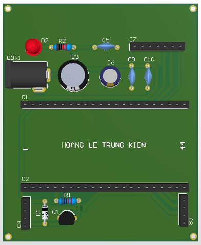

# PayVoice Box (Audio & HMI Expansion Board)

A specialized breakout baseboard designed to interface a microcontroller module (44-pin footprint) with digital audio, visual display, and alert peripherals.

## Functions
*   **Audio Interface:** Breaks out I2S bus signals (LRC, BCLK, DIN) for connection to external DACs or I2S amplifiers.
*   **HMI Connection:** Dedicated 4-pin header for I2C displays (OLED/LCD) with power delivery.
*   **Acoustic Alert:** Onboard driver circuit for a passive/active buzzer.
*   **Modular Design:** Dual 22-pin headers (U1_L/U1_R) allow for easy insertion and replacement of the main MCU control board.

## Technical Highlights (Design Evaluation)

This board ensures stable operation for audio applications through robust filtering and protection:

*   **Inductive Load Protection:** The buzzer circuit utilizes an **S8050 NPN transistor** for high-current driving, isolated from the MCU GPIO. Crucially, a **1N4148 Flyback Diode** is placed across the buzzer terminals to clamp voltage spikes, protecting the transistor from inductive kickback.
*   **Power Stability:** Features a large bulk capacitor bank (**470µF + 100µF**) near the power input. This prevents voltage sagging during current spikes (e.g., buzzer activation or WiFi bursts), which is critical for maintaining noise-free audio signals.
*   **Signal Integrity:** Decoupling capacitors (100nF) are placed at the Audio and Buzzer headers to filter high-frequency noise.

## Specifications
*   **Input Power:** 5V DC (via DC Jack CON1).
*   **Logic Level:** Dependent on plugged MCU module (typically 3.3V).
*   **Audio Protocol:** I2S (Inter-IC Sound).
*   **Display Protocol:** I2C.

## Pinout
| Header | Description |
| :--- | :--- |
| **J_AUDIO** | I2S Output (LRC, BCLK, DIN) + 5V/GND |
| **J_LCD** | I2C Display (SDA, SCL) + 5V/GND |
| **J_BUZZER** | Buzzer Output (Switched Ground) |
| **CON1** | Main Power Input (5V) |
